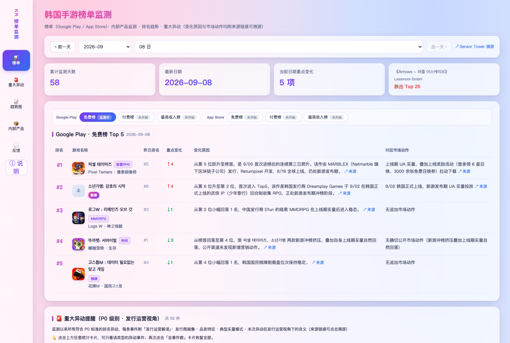
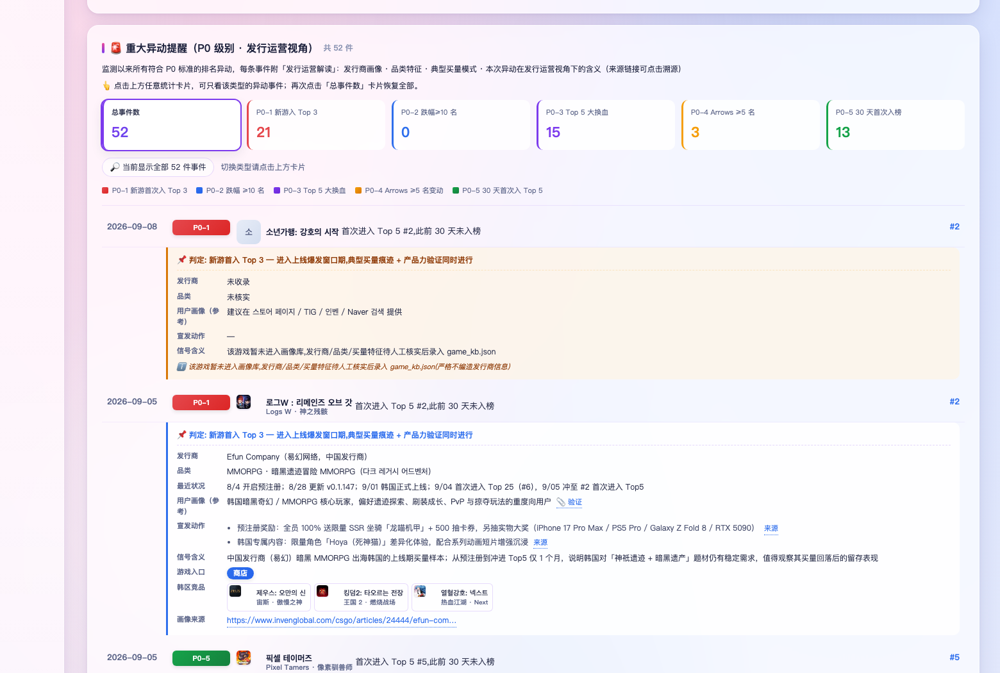
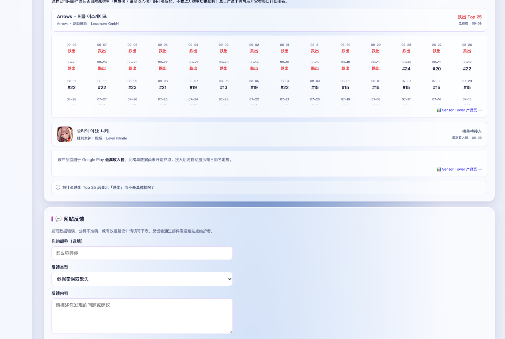

# 韩国 Google Play 游戏免费榜 Top 5 · 每日异动监测看板

> 把"今天榜单前五是谁"升级成"谁进谁出、为什么、意味着什么"，每天自动更新，打开就能看。

**在线看板**：<https://angiunangiun7777777-cmyk.github.io/kr-GP-free-top5-monitor-site/>

   

## 这个项目想解决什么问题

韩国手游市场的变化是以"天"计的。免费榜前五每天都可能换血，一款新游冲上来或者一款老游跌出去，背后通常对应一次版本更新、一场 IP 联动，或者一轮买量投放。靠人工每天截图对比，既耗时又容易漏掉"悄悄跌出榜外"这类没有任何提示的变化。

所以这个看板要做的不是把榜单数字搬到网页上，而是回答三个更实际的问题：海外重点市场现在什么品类在起量、榜单前五的进出到底由什么驱动、以及做市场判断时能直接参考哪些公开信息。

## 看板里有什么

**榜单区**展示当日 Top 5，每款游戏都带图标、中文译名、昨日排名和变化幅度，旁边跟着变化原因和对应的市场动作，鼠标悬停能看到该游戏近期的排名轨迹。

**重大异动区（P0）**是这个看板的核心。系统每天自动扫描榜单，把真正值得关注的变动挑出来分级，再对每款游戏做逐款拆解：它是新游还是回榜、发行商是谁、属于什么品类、这次变动的公开依据在哪。Top 5 大换血这类复杂事件还会额外给出一条结构性结论，说明这次换血到底由什么驱动。

**重点产品监测区**对指定的重点产品做单独跟踪，展示其在榜单中的实时位次与近期走势，不受榜单日期切换影响。

## 数据口径

监测范围是韩国区 Google Play 游戏免费榜，每天抓取 Top 25 快照并重点跟踪 Top 5。每天韩国时间 06:00 自动更新，取的是**前一日已经定版的最终榜单**——这里刻意不用当日快照，因为当天还没走完，Sensor Tower 返回的实时数据会出现"零变动"的假象，用它做判断会得出错误结论。榜单数据来自 Sensor Tower 公开榜单。

## P0 异动判定规则

| 类型 | 触发条件 | 关注点 |
| --- | --- | --- |
| P0-1 | 新游首次进入 Top 3 | 新游冲榜，通常伴随首发活动或买量 |
| P0-2 | 单日排名跌幅 ≥ 10 名 | 突发下滑，可能是事故、版本口碑或竞品挤压 |
| P0-3 | 一日内 Top 5 有 ≥ 4 款同时变化 | 大换血，需要判断是新游集体冲榜还是老游集中回榜 |
| P0-4 | 重点产品变动 ≥ 5 名或跌出 Top 25 | 指定产品的专项预警 |
| P0-5 | 30 天内首次进入 Top 5 | 老游回榜或新游爬升到头部 |

同一款游戏因为版本更新或联动改了名字再回榜，不会被误判成新游——知识库里维护了游戏别名，能把改名后的名字归一到同一款游戏，并标注"回榜识别"。

## 解读的三条可靠性原则

这个看板刻意区分了三种信息，因为做市场分析时最危险的不是数据错，而是把推测当成事实。

**事实层**必须真实可复核。排名、涨跌、进出这些都来自榜单本身，每个结论都附可点开的来源链接；纯文字描述的来源不会被伪装成链接。

**归因层**宁可承认不知道。游戏的发行商、品类、量级如果查不到可靠出处，就明确标注"未收录"或"待核实"，绝不填一个看起来合理的推测值。

**推断层**必须有出处才保留。像用户画像、宣发动作这类本质上是推断的内容，一律标注"（参考）"并附验证链接；找不到来源的解释直接删掉，不用套话填补空白。

## 技术设计

数据侧维护了一份游戏知识库，收录 40 多款上榜游戏的发行商、品类、图标、中文译名、近期动态与别名，作为解读的基础；排名数据通过浏览器自动化从 Sensor Tower 公开榜单采集。

管道是三段式：采集脚本抓取每日榜单，合并脚本做数据归一并写入单一事实来源（seed 数据），导出脚本计算 P0 异动、套用知识库解读，最终渲染成一个自包含的 HTML 文件。整个过程跑在 GitHub Actions 上，每天定时执行"抓取 → 合并 → 导出 → 发布"，失败会自动创建 issue 告警。

前端是零依赖的单页应用，数据和样式全部内联在这一个 HTML 文件里。这样做的好处是打开就能看、离线也能看，直接把文件发给同事对方双击即可，不需要起服务也不需要联网。

## 路线图

- 榜单维度：从韩国单一免费榜扩展到韩国、日本、中国台湾、美国四个地区，每个地区覆盖免费榜与最高收入榜（流水），首页做成可横向对比的总览
- 新游信息：在异动事件里补充游戏的上线时间
- 外部入口：为上榜游戏补齐商店、官网、预注册活动页与官方社群四类链接，便于直接参考同行的营销与社群运营打法

## 本地使用

直接下载 `index.html`，双击用浏览器打开即可，不需要任何依赖或网络。数据已经完整嵌在文件里。

## 说明与免责

本仓库只发布渲染后的看板页面，`index.html` 由自动化流程每日覆盖，手动修改会被下一次更新冲掉；数据采集与处理的脚本、原始数据存放在独立的私有仓库中。

榜单数据的版权归 Sensor Tower 所有，游戏名称、图标与相关素材的版权归各自发行商所有。本项目仅用于市场研究与内部参考，不作商业用途。代码中除数据外的内容基于 MIT 协议开放，详见 [LICENSE](LICENSE)。
